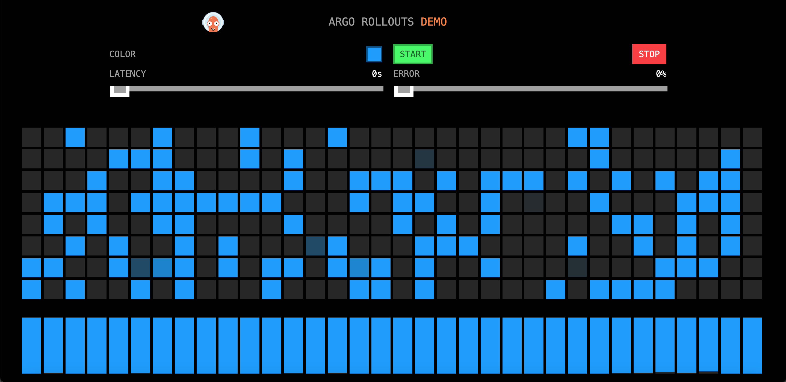
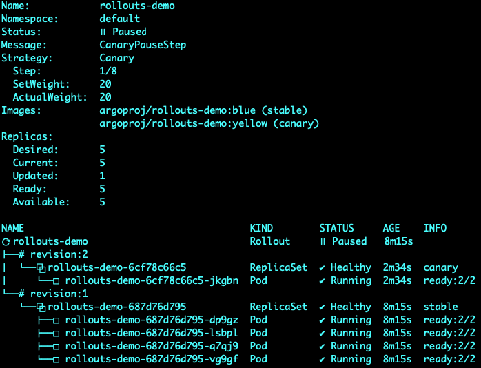

# Basic Usage

Rollout对象本身是一个类似于deployment的控制器，主要字段包括：

- strategy: 升级策略，steps指定升级流程
- template：pod模版

## 部署Rollout

rollouts.yaml

```yaml
apiVersion: argoproj.io/v1alpha1
kind: Rollout
metadata:
  name: rollouts-demo
spec:
  replicas: 5
  strategy:
    canary:
      steps:
      - setWeight: 20
      - pause: {}
      - setWeight: 40
      - pause: {duration: 10}
      - setWeight: 60
      - pause: {duration: 10}
      - setWeight: 80
      - pause: {duration: 10}
  revisionHistoryLimit: 2
  selector:
    matchLabels:
      app: rollouts-demo
  template:
    metadata:
      labels:
        app: rollouts-demo
    spec:
      containers:
      - name: rollouts-demo
        image: argoproj/rollouts-demo:blue
        ports:
        - name: http
          containerPort: 8080
          protocol: TCP
        resources:
          requests:
            memory: 32Mi
            cpu: 5m
```

service.yaml

```yaml
apiVersion: v1
kind: Service
metadata:
  name: rollouts-demo
spec:
  ports:
  - port: 80
    targetPort: http
    protocol: TCP
    name: http
  type: NodePort
  selector:
    app: rollouts-demo
```

部署完成后通过浏览器访问`宿主机IP:NodePort`，可以看到如下页面，所有点都是蓝色的：



## 升级Rollout

执行命令

```shell
kubectl argo rollouts set image rollouts-demo rollouts-demo=argoproj/rollouts-demo:yellow
```

使用以下命令持续查看rollout状态

```shell
kubectl argo rollouts get rollout rollouts-demo --watch
```


