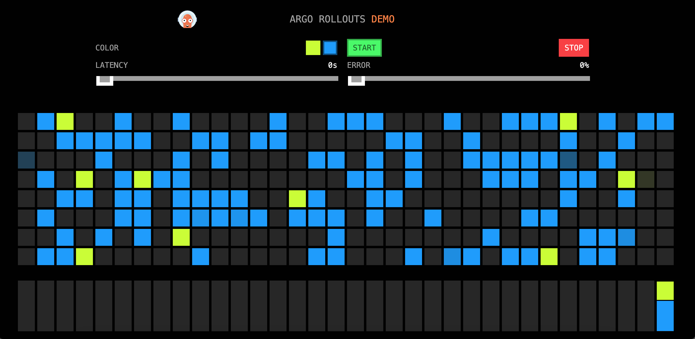
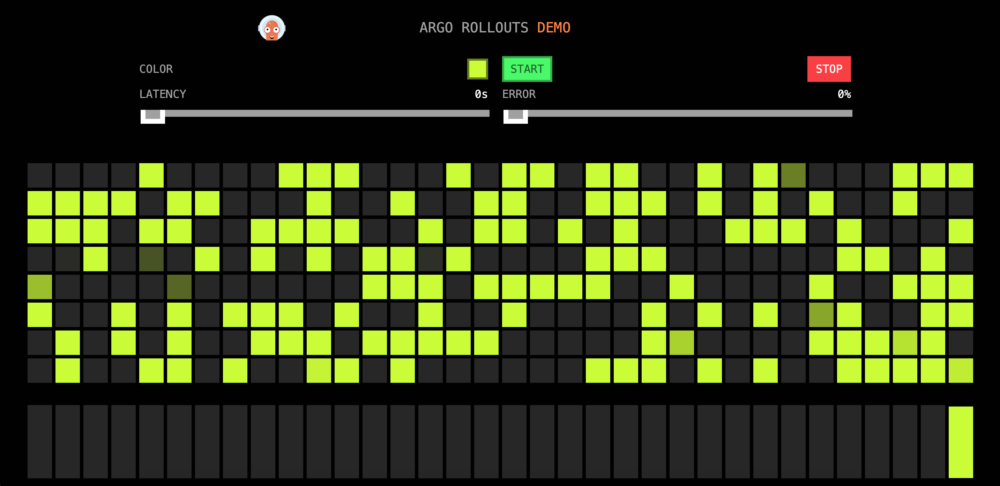
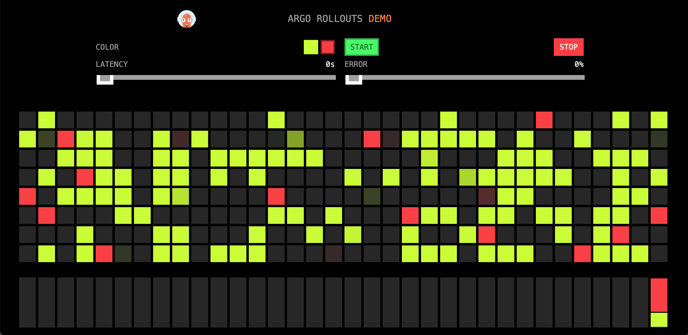
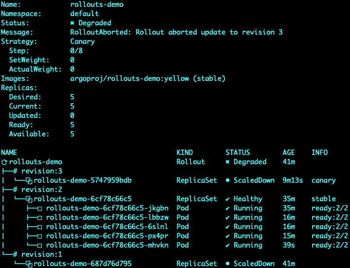

# Basic Usage

Rollout对象本身是一个类似于deployment的控制器，主要字段包括：

- strategy: 升级策略，steps指定升级流程
- template：pod模版

Rollout对象创建和升级时，会进行以下操作：

1. 创建时，生成一个replicaset控制pod副本数。
2. 升级时，每个新版本都会创建一个replicaset。
3. 升级过程中，根据strategy配置执行升级流程，包含暂停等操作。

## 部署Rollout

rollout指定当前要部署`blue`版本的应用，一共5个副本，在未来升级时（部署时不管strategy策略），根据steps配置先升级20%（1个副本），用户确认后在升级剩下副本或者进行回滚。

```yaml
apiVersion: argoproj.io/v1alpha1
kind: Rollout
metadata:
  name: rollouts-demo
spec:
  replicas: 5
  strategy:
    canary:
      steps:
      - setWeight: 20
      - pause: {}
      - setWeight: 40
      - pause: {duration: 10}
      - setWeight: 60
      - pause: {duration: 10}
      - setWeight: 80
      - pause: {duration: 10}
  revisionHistoryLimit: 2
  selector:
    matchLabels:
      app: rollouts-demo
  template:
    metadata:
      labels:
        app: rollouts-demo
    spec:
      containers:
      - name: rollouts-demo
        image: argoproj/rollouts-demo:blue
        ports:
        - name: http
          containerPort: 8080
          protocol: TCP
        resources:
          requests:
            memory: 32Mi
            cpu: 5m
```

service通过NodePort暴露端口，让我们可以通过宿主机ip进行访问。

```yaml
apiVersion: v1
kind: Service
metadata:
  name: rollouts-demo
spec:
  ports:
  - port: 80
    targetPort: http
    protocol: TCP
    name: http
  type: NodePort
  selector:
    app: rollouts-demo
```

部署完成后通过浏览器访问`宿主机IP:NodePort`，可以看到如下页面，所有点都是蓝色的：


## 升级Rollout - Pause

执行命令

```shell
kubectl argo rollouts set image rollouts-demo rollouts-demo=argoproj/rollouts-demo:yellow
```

使用以下命令持续查看rollout状态，发现一个副本被升级为yellow，整个rollouts处于`Paused`状态

```shell
kubectl argo rollouts get rollout rollouts-demo --watch
```


此时访问`宿主机IP:NodePort`，发现页面上出现部分黄点（因为使用service进行负载并不能保证黄点占20%，有可能出现很多，需要多刷新页面）：



## 升级Rollout - Promote

执行以下命令，使处于暂停状态的rollouts继续执行：

```shell
kubectl argo rollouts promote rollouts-demo
```

在升级的过程中，新版本的replicaset副本数不断增加，当前版本的副本数不断减少，最终所有副本数都变为新版本，完成升级。访问页面`宿主机IP:NodePort`，发现所有的点都变成了黄色：



## 升级Rollout - Abort

执行以下命令开始升级red版本：

```shell
kubectl argo rollouts set image rollouts-demo rollouts-demo=argoproj/rollouts-demo:red
```

升级完成后访问页面，出现部分红色节点（因为使用service进行负载并不能保证红点占20%，有可能出现很多，需要多刷新页面）：



此时我们不希望继续升级，所以执行以下命令进行回滚：

```shell
kubectl argo rollouts abort rollouts-demo
```

使用命令查看rollout状态

```shell
kubectl argo rollouts get rollout rollouts-demo --watch
```



发现红点被完全移除，此时正在运行的镜像为`yellow`。因为实际上此时rollout配置的期望镜像为`red`，所以整体状态为`Degrated`，如果我们期望rollout回到正常状态，需要执行以下命令将镜像改为`yellow`：

```shell
kubectl argo rollouts set image rollouts-demo rollouts-demo=argoproj/rollouts-demo:yellow
```
