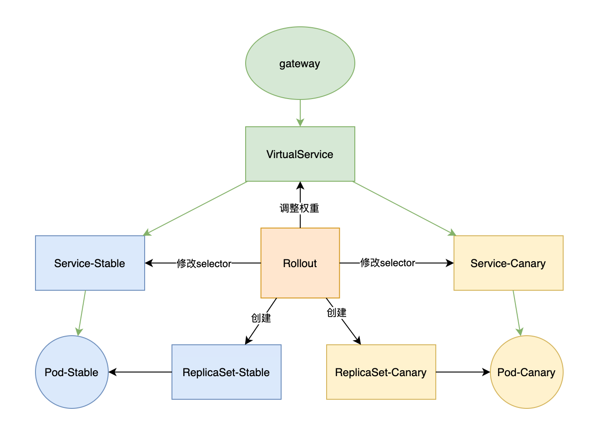
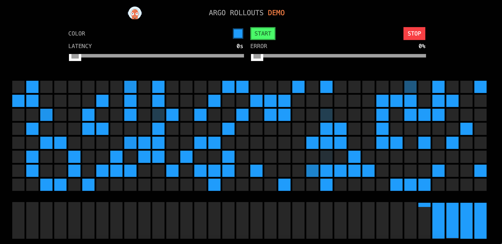
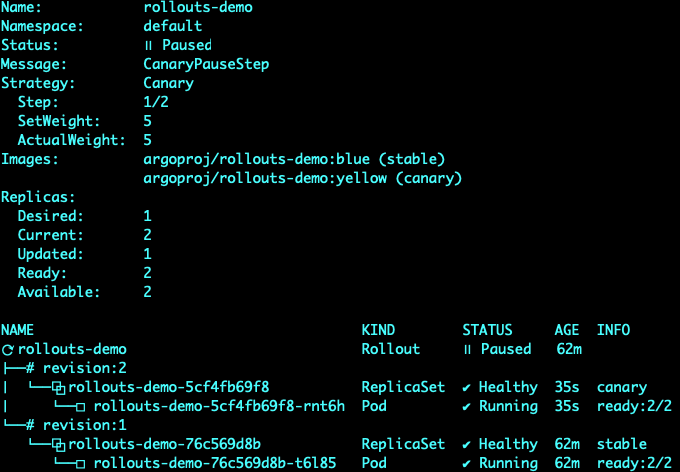
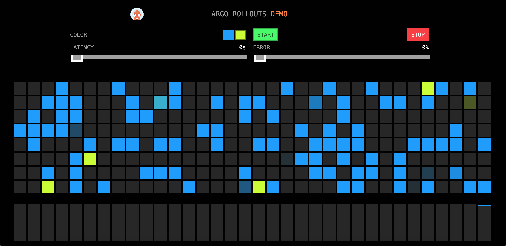
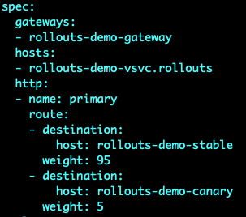
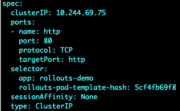

# Istio

Rollout可以结合istio使用，针对istio，升级时会有以下操作：

- 根据steps配置自动调整virtualService权重
- 根据canaryService和stableService配置自动修改对应service的selector（增加rollouts-pod-template-hash）




## 部署

Rollout配置只用istio作为流量转发入口。

```yaml
apiVersion: argoproj.io/v1alpha1
kind: Rollout
metadata:
  name: rollouts-demo
spec:
  replicas: 1
  strategy:
    canary:
      canaryService: rollouts-demo-canary
      stableService: rollouts-demo-stable
      trafficRouting:
        istio:
          virtualServices:
          - name: rollouts-demo-vsvc # At least one virtualService is required
            routes:
            - primary # At least one route is required
      steps:
      - setWeight: 5
      - pause: {}
  revisionHistoryLimit: 2
  selector:
    matchLabels:
      app: rollouts-demo
  template:
    metadata:
      labels:
        app: rollouts-demo
        istio-injection: enabled
    spec:
      containers:
      - name: rollouts-demo
        image: argoproj/rollouts-demo:blue
        ports:
        - name: http
          containerPort: 8080
          protocol: TCP
        resources:
          requests:
            memory: 32Mi
            cpu: 5m
```

创建两个service分别指向stable和canary版本。

```yaml
apiVersion: v1
kind: Service
metadata:
  name: rollouts-demo-canary
spec:
  ports:
  - port: 80
    targetPort: http
    protocol: TCP
    name: http
  selector:
    app: rollouts-demo
    # This selector will be updated with the pod-template-hash of the canary ReplicaSet. e.g.:
    # rollouts-pod-template-hash: 7bf84f9696

---
apiVersion: v1
kind: Service
metadata:
  name: rollouts-demo-stable
spec:
  ports:
  - port: 80
    targetPort: http
    protocol: TCP
    name: http
  selector:
    app: rollouts-demo
    # This selector will be updated with the pod-template-hash of the stable ReplicaSet. e.g.:
    # rollouts-pod-template-hash: 789746c88d
```

VirtualService中默认stable权重为100，升级过程中rollout会自动调整。

```yaml
apiVersion: networking.istio.io/v1alpha3
kind: VirtualService
metadata:
  name: rollouts-demo-vsvc
spec:
  gateways:
  - rollouts-demo-gateway
  hosts:
  - rollouts-demo-vsvc.rollouts
  http:
  - name: primary
    route:
    - destination:
        host: rollouts-demo-stable
      weight: 100
    - destination:
        host: rollouts-demo-canary
      weight: 0
  tls:
  - match:
    - port: 3000
      sniHosts:
      - rollouts-demo-vsvc.rollouts
    route:
    - destination:
        host: rollouts-demo-stable
      weight: 100
    - destination:
        host: rollouts-demo-canary
      weight: 0
```

Gateway流量入口为*.rollouts

```yaml
apiVersion: networking.istio.io/v1alpha3
kind: Gateway
metadata:
  name: rollouts-demo-gateway
spec:
  selector:
    istio: ingress
  servers:
  - port:
      number: 80
      name: http
      protocol: HTTP
    hosts:
    - "*.rollouts"
```

## 访问

1. 在浏览器所在的电脑上/etc/hosts中增加配置

```
<宿主机IP> rollouts-demo-vsvc.rollouts
```

2. 查询istio-ingress service，找到80对应的外部端口30096

```shell
kubectl get svc -A | grep ingress
```


3. 访问`rollouts-demo-vsvc.rollouts:30096`



## 升级

执行以下命令升级为`yellow`版本

```shell
kubectl argo rollouts set image rollouts-demo rollouts-demo=argoproj/rollouts-demo:yellow
```

查看当前状态

```shell
kubectl argo rollouts get rollout rollouts-demo --watch
```



访问`rollouts-demo-vsvc.rollouts:30096`，发现部分节点变为黄色



此时，VirtualSerice上的权重被自动调整为95和5（原来是100和0）



Service中selector多了rollouts-pod-template-hash字段。


