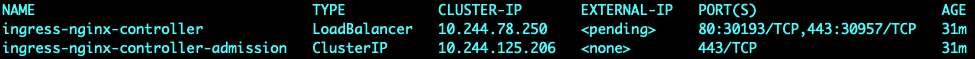
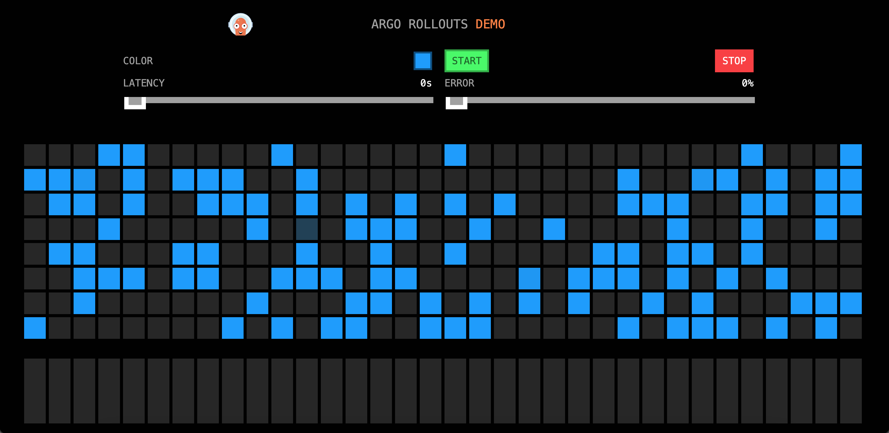
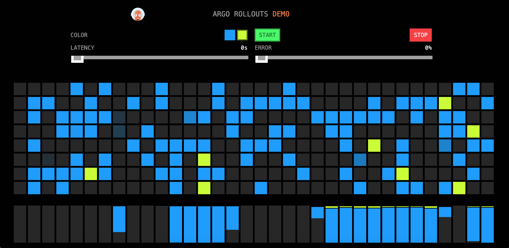

# Nginx

## 部署

Rollout中strategy设置为nginx，其stableIngress指向我们创建的ingress对象。

```yaml
apiVersion: argoproj.io/v1alpha1
kind: Rollout
metadata:
  name: rollouts-demo
spec:
  replicas: 1
  strategy:
    canary:
      canaryService: rollouts-demo-canary
      stableService: rollouts-demo-stable
      trafficRouting:
        nginx:
          stableIngress: rollouts-demo-stable
      steps:
      - setWeight: 5
      - pause: {}
  revisionHistoryLimit: 2
  selector:
    matchLabels:
      app: rollouts-demo
  template:
    metadata:
      labels:
        app: rollouts-demo
    spec:
      containers:
      - name: rollouts-demo
        image: argoproj/rollouts-demo:blue
        ports:
        - name: http
          containerPort: 8080
          protocol: TCP
        resources:
          requests:
            memory: 32Mi
            cpu: 5m
```

用两个Service分别指向canary和stable版本，初始时两个service selector一样，升级后rollout会自动在selector中增加rollouts-pod-template-hash。

```yaml
apiVersion: v1
kind: Service
metadata:
  name: rollouts-demo-canary
spec:
  ports:
  - port: 80
    targetPort: http
    protocol: TCP
    name: http
  selector:
    app: rollouts-demo
    # This selector will be updated with the pod-template-hash of the canary ReplicaSet. e.g.:
    # rollouts-pod-template-hash: 7bf84f9696

---
apiVersion: v1
kind: Service
metadata:
  name: rollouts-demo-stable
spec:
  ports:
  - port: 80
    targetPort: http
    protocol: TCP
    name: http
  selector:
    app: rollouts-demo
    # This selector will be updated with the pod-template-hash of the stable ReplicaSet. e.g.:
    # rollouts-pod-template-hash: 789746c88d
```

Ingress指定访问路径，rollout会自动创建一个新的Ingress `<ROLLOUT-NAME>-<INGRESS-NAME>-canary`作为未来升级版本的流量入口，在`Ingress`中增加annotation `nginx.ingress.kubernetes.io/canary-weight: "0" `用于控制权重。

```yaml
apiVersion: networking.k8s.io/v1beta1
kind: Ingress
metadata:
  name: rollouts-demo-stable
  annotations:
    kubernetes.io/ingress.class: nginx
spec:
  rules:
  - host: rollouts-demo.local
    http:
      paths:
      - path: /
        backend:
          # Reference to a Service name, also specified in the Rollout spec.strategy.canary.stableService field
          serviceName: rollouts-demo-stable
          servicePort: 80
```

## 访问

1. 浏览器所在机器在/etc/hosts增加配置：

```
<宿主机IP> rollouts-demo.loca
```

2. 查询ingress-nginx service，找到80对应的外部端口30193

```
kubectl get svc -n ingress-nginx
```



3. 访问 `rollouts-demo.local:30193`，初始的点都为蓝色。



## 升级

执行命令进行升级

```shell
kubectl argo rollouts set image rollouts-demo rollouts-demo=argoproj/rollouts-demo:yellow
```

访问 `rollouts-demo.local:30193`，出现部分黄点：



此时观察Ingress `<ROLLOUT-NAME>-<INGRESS-NAME>-canary`对象，发现其`nginx.ingress.kubernetes.io/canary-weight `被设置为5。