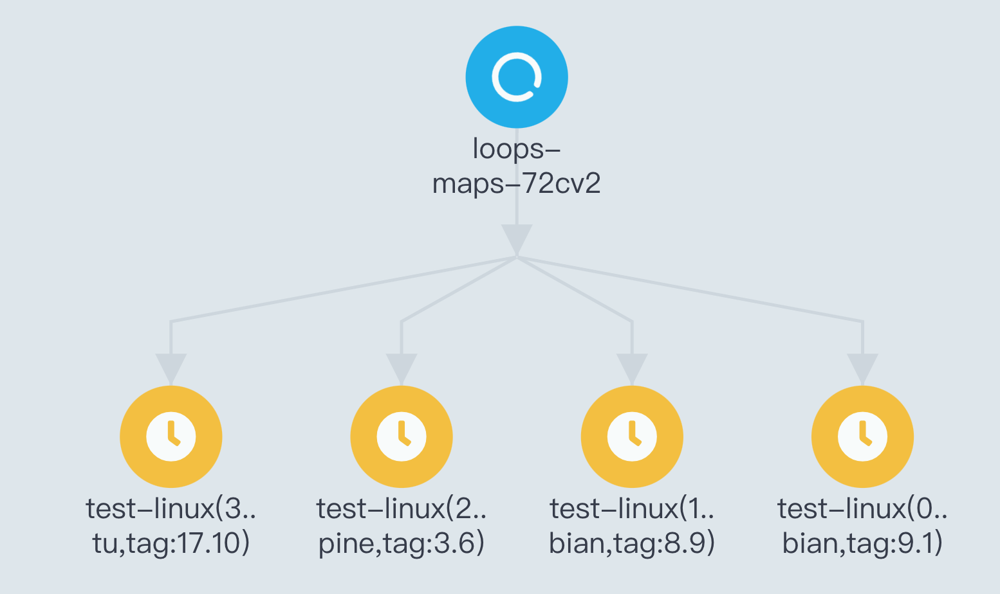

# Workflows

argo命令行操作

```shell
argo submit hello-world.yaml    # submit a workflow spec to Kubernetes
argo list                       # list current workflows
argo get hello-world-xxx        # get info about a specific workflow
argo logs hello-world-xxx       # print the logs from a workflow
argo delete hello-world-xxx     # delete workflow
```

kubectl命令行操作

```shell
kubectl create -f hello-world.yaml
kubectl get wf
kubectl get wf hello-world-xxx
kubectl get po --selector=workflows.argoproj.io/workflow=hello-world-xxx --show-all  # similar to argo
kubectl logs hello-world-xxx-yyy -c main
kubectl delete wf hello-world-xxx
```

## Parameters

相关命令

```shell
# 指定参数
argo submit arguments-parameters.yaml -p message="goodbye world"
# 指定参数文件
argo submit arguments-parameters.yaml --parameter-file params.yaml
# 修改默认entrypoint
argo submit arguments-parameters.yaml --entrypoint whalesay-caps
```

局部变量，在templates字段下增加`inputs.parameters`配置

```yaml
apiVersion: argoproj.io/v1alpha1
kind: Workflow
metadata:
  generateName: hello-world-parameters-
spec:
  # invoke the whalesay template with
  # "hello world" as the argument
  # to the message parameter
  entrypoint: whalesay
  arguments:
    parameters:
    - name: message
      value: hello world
  templates:
  - name: whalesay
    inputs:
      parameters:
      - name: message       # parameter declaration
    container:
      # run cowsay with that message input parameter as args
      image: docker/whalesay
      command: [cowsay]
      args: ["{{inputs.parameters.message}}"]
```

全局变量，直接使用`{{workflow.parameters.parameter_name}}`获取

```yaml
apiVersion: argoproj.io/v1alpha1
kind: Workflow
metadata:
  generateName: global-parameters-
spec:
  entrypoint: A
  arguments:
    parameters:
    - name: log-level
      value: INFO
  templates:
  - name: A
    container:
      image: containerA
      env:
      - name: LOG_LEVEL
        value: "{{workflow.parameters.log-level}}"
      command: [runA]
  - name: B
    container:
      image: containerB
      env:
      - name: LOG_LEVEL
        value: "{{workflow.parameters.log-level}}"
      command: [runB]
```

## Steps

```yaml
apiVersion: argoproj.io/v1alpha1
kind: Workflow
metadata:
  generateName: steps-
spec:
  entrypoint: hello-hello-hello

  # This spec contains two templates: hello-hello-hello and whalesay
  templates:
  - name: hello-hello-hello
    # Instead of just running a container
    # This template has a sequence of steps
    steps:
    - - name: hello1            # hello1 is run before the following steps
        template: whalesay
        arguments:
          parameters:
          - name: message
            value: "hello1"
    - - name: hello2a           # double dash => run after previous step
        template: whalesay
        arguments:
          parameters:
          - name: message
            value: "hello2a"
      - name: hello2b           # single dash => run in parallel with previous step
        template: whalesay
        arguments:
          parameters:
          - name: message
            value: "hello2b"

  # This is the same template as from the previous example
  - name: whalesay
    inputs:
      parameters:
      - name: message
    container:
      image: docker/whalesay
      command: [cowsay]
      args: ["{{inputs.parameters.message}}"]
```

## DAG

```yaml
apiVersion: argoproj.io/v1alpha1
kind: Workflow
metadata:
  generateName: dag-diamond-
spec:
  entrypoint: diamond
  templates:
  - name: echo
    inputs:
      parameters:
      - name: message
    container:
      image: alpine:3.7
      command: [echo, "{{inputs.parameters.message}}"]
  - name: diamond
    dag:
      tasks:
      - name: A
        template: echo
        arguments:
          parameters: [{name: message, value: A}]
      - name: B
        dependencies: [A]
        template: echo
        arguments:
          parameters: [{name: message, value: B}]
      - name: C
        dependencies: [A]
        template: echo
        arguments:
          parameters: [{name: message, value: C}]
      - name: D
        dependencies: [B, C]
        template: echo
        arguments:
          parameters: [{name: message, value: D}]
```

## Artifacts

```yaml
apiVersion: argoproj.io/v1alpha1
kind: Workflow
metadata:
  generateName: artifact-passing-
spec:
  entrypoint: artifact-example
  templates:
  - name: artifact-example
    steps:
    - - name: generate-artifact
        template: whalesay
    - - name: consume-artifact
        template: print-message
        arguments:
          artifacts:
          # bind message to the hello-art artifact
          # generated by the generate-artifact step
          - name: message
            from: "{{steps.generate-artifact.outputs.artifacts.hello-art}}"
  - name: whalesay
    container:
      image: docker/whalesay:latest
      command: [sh, -c]
      args: ["cowsay hello world | tee /tmp/hello_world.txt"]
    outputs:
      artifacts:
      # generate hello-art artifact from /tmp/hello_world.txt
      # artifacts can be directories as well as files
      - name: hello-art
        path: /tmp/hello_world.txt
  - name: print-message
    inputs:
      artifacts:
      # unpack the message input artifact
      # and put it at /tmp/message
      - name: message
        path: /tmp/message
    container:
      image: alpine:latest
      command: [sh, -c]
      args: ["cat /tmp/message"]
```

如果需要指定压缩方式，使用`archive`关键字

```yaml
<... snipped ...>
    outputs:
      artifacts:
        # default behavior - tar+gzip default compression.
      - name: hello-art-1
        path: /tmp/hello_world.txt

        # disable archiving entirely - upload the file / directory as is.
        # this is useful when the container layout matches the desired target repository layout.   
      - name: hello-art-2
        path: /tmp/hello_world.txt
        archive:
          none: {}

        # customize the compression behavior (disabling it here).
        # this is useful for files with varying compression benefits, 
        # e.g. disabling compression for a cached build workspace and large binaries, 
        # or increasing compression for "perfect" textual data - like a json/xml export of a large database.
      - name: hello-art-3
        path: /tmp/hello_world.txt
        archive:
          tar:
            # no compression (also accepts the standard gzip 1 to 9 values)
            compressionLevel: 0
<... snipped ...>
```

如果需要指定回收策略，使用`artifactGC`关键字，如果需要指定sa和annotations，使用`serviceAccountName`和`podMetadata`

```yaml
apiVersion: argoproj.io/v1alpha1
kind: Workflow
metadata:
  generateName: artifact-gc-
spec:
  entrypoint: main
  artifactGC:
    strategy: OnWorkflowDeletion 
    ##############################################################################################
    #    Workflow Level Service Account and Metadata
    ##############################################################################################
    serviceAccountName: my-sa
    podMetadata:
      annotations:
        eks.amazonaws.com/role-arn: arn:aws:iam::111122223333:role/my-iam-role
  templates:
    - name: main
      container:
        image: argoproj/argosay:v2
        command:
          - sh
          - -c
        args:
          - |
            echo "can throw this away" > /tmp/temporary-artifact.txt
            echo "keep this" > /tmp/keep-this.txt
      outputs:
        artifacts:
          - name: temporary-artifact
            path: /tmp/temporary-artifact.txt
            s3:
              key: temporary-artifact-{{workflow.uid}}.txt
            artifactGC:
              ####################################################################################
              #    Optional override capability
              ####################################################################################
              serviceAccountName: artifact-specific-sa
              podMetadata:
                annotations:
                  eks.amazonaws.com/role-arn: arn:aws:iam::111122223333:role/artifact-specific-iam-role
          - name: keep-this
            path: /tmp/keep-this.txt
            s3:
              key: keep-this-{{workflow.uid}}.txt
            artifactGC:
              strategy: Never
```

## Hardwired Artifacts

argo内置了对 git, HTTP, GCS 和 S3 的支持

```yaml
apiVersion: argoproj.io/v1alpha1
kind: Workflow
metadata:
  generateName: hardwired-artifact-
spec:
  entrypoint: hardwired-artifact
  templates:
  - name: hardwired-artifact
    inputs:
      artifacts:
      # Check out the master branch of the argo repo and place it at /src
      # revision can be anything that git checkout accepts: branch, commit, tag, etc.
      - name: argo-source
        path: /src
        git:
          repo: https://github.com/argoproj/argo-workflows.git
          revision: "master"
      # Download kubectl 1.8.0 and place it at /bin/kubectl
      - name: kubectl
        path: /bin/kubectl
        mode: 0755
        http:
          url: https://storage.googleapis.com/kubernetes-release/release/v1.8.0/bin/linux/amd64/kubectl
      # Copy an s3 compatible artifact repository bucket (such as AWS, GCS and MinIO) and place it at /s3
      - name: objects
        path: /s3
        s3:
          endpoint: storage.googleapis.com
          bucket: my-bucket-name
          key: path/in/bucket
          accessKeySecret:
            name: my-s3-credentials
            key: accessKey
          secretKeySecret:
            name: my-s3-credentials
            key: secretKey
    container:
      image: debian
      command: [sh, -c]
      args: ["ls -l /src /bin/kubectl /s3"]
```

## Secrets

在Workflow中定义`volumes`指定secret，在templates中使用volumeMounts绑定。

```yaml
# To run this example, first create the secret by running:
# kubectl create secret generic my-secret --from-literal=mypassword=S00perS3cretPa55word
apiVersion: argoproj.io/v1alpha1
kind: Workflow
metadata:
  generateName: secret-example-
spec:
  entrypoint: whalesay
  # To access secrets as files, add a volume entry in spec.volumes[] and
  # then in the container template spec, add a mount using volumeMounts.
  volumes:
  - name: my-secret-vol
    secret:
      secretName: my-secret     # name of an existing k8s secret
  templates:
  - name: whalesay
    container:
      image: alpine:3.7
      command: [sh, -c]
      args: ['
        echo "secret from env: $MYSECRETPASSWORD";
        echo "secret from file: `cat /secret/mountpath/mypassword`"
      ']
      # To access secrets as environment variables, use the k8s valueFrom and
      # secretKeyRef constructs.
      env:
      - name: MYSECRETPASSWORD  # name of env var
        valueFrom:
          secretKeyRef:
            name: my-secret     # name of an existing k8s secret
            key: mypassword     # 'key' subcomponent of the secret
      volumeMounts:
      - name: my-secret-vol     # mount file containing secret at /secret/mountpath
        mountPath: "/secret/mountpath"
```

## Scripts And Results

```yaml
apiVersion: argoproj.io/v1alpha1
kind: Workflow
metadata:
  generateName: scripts-bash-
spec:
  entrypoint: bash-script-example
  templates:
  - name: bash-script-example
    steps:
    - - name: generate
        template: gen-random-int-bash
    - - name: print
        template: print-message
        arguments:
          parameters:
          - name: message
            value: "{{steps.generate.outputs.result}}"  # The result of the here-script

  - name: gen-random-int-bash
    script:
      image: debian:9.4
      command: [bash]
      source: |                                         # Contents of the here-script
        cat /dev/urandom | od -N2 -An -i | awk -v f=1 -v r=100 '{printf "%i\n", f + r * $1 / 65536}'

  - name: gen-random-int-python
    script:
      image: python:alpine3.6
      command: [python]
      source: |
        import random
        i = random.randint(1, 100)
        print(i)

  - name: gen-random-int-javascript
    script:
      image: node:9.1-alpine
      command: [node]
      source: |
        var rand = Math.floor(Math.random() * 100);
        console.log(rand);

  - name: print-message
    inputs:
      parameters:
      - name: message
    container:
      image: alpine:latest
      command: [sh, -c]
      args: ["echo result was: {{inputs.parameters.message}}"]
```

## Output Parameters

```yaml
apiVersion: argoproj.io/v1alpha1
kind: Workflow
metadata:
  generateName: output-parameter-
spec:
  entrypoint: output-parameter
  templates:
  - name: output-parameter
    steps:
    - - name: generate-parameter
        template: whalesay
    - - name: consume-parameter
        template: print-message
        arguments:
          parameters:
          # Pass the hello-param output from the generate-parameter step as the message input to print-message
          - name: message
            value: "{{steps.generate-parameter.outputs.parameters.hello-param}}"

  - name: whalesay
    container:
      image: docker/whalesay:latest
      command: [sh, -c]
      args: ["echo -n hello world > /tmp/hello_world.txt"]  # generate the content of hello_world.txt
    outputs:
      parameters:
      - name: hello-param  # name of output parameter
        valueFrom:
          path: /tmp/hello_world.txt # set the value of hello-param to the contents of this hello-world.txt

  - name: print-message
    inputs:
      parameters:
      - name: message
    container:
      image: docker/whalesay:latest
      command: [cowsay]
      args: ["{{inputs.parameters.message}}"]
```

默认的outputs在`outputs.result`中，最大允许256kb，包括

- `{{ tasks.xxx.outputs.result }}`
- `{{ steps.xxx.outputs.result }}`

## Loops

使用`withItems`并行执行工作流

```yaml
apiVersion: argoproj.io/v1alpha1
kind: Workflow
metadata:
  generateName: loops-maps-
spec:
  entrypoint: loop-map-example
  templates:
  - name: loop-map-example
    steps:
    - - name: test-linux
        template: cat-os-release
        arguments:
          parameters:
          - name: image
            value: "{{item.image}}"
          - name: tag
            value: "{{item.tag}}"
        withItems:
        - { image: 'debian', tag: '9.1' }       #item set 1
        - { image: 'debian', tag: '8.9' }       #item set 2
        - { image: 'alpine', tag: '3.6' }       #item set 3
        - { image: 'ubuntu', tag: '17.10' }     #item set 4
  - name: cat-os-release
    inputs:
      parameters:
      - name: image
      - name: tag
    container:
      image: "{{inputs.parameters.image}}:{{inputs.parameters.tag}}"
      command: [cat]
      args: [/etc/os-release]
```

执行结果



使用`withParam`关键字传入列表参数

```yaml
apiVersion: argoproj.io/v1alpha1
kind: Workflow
metadata:
  generateName: loops-param-arg-
spec:
  entrypoint: loop-param-arg-example
  arguments:
    parameters:
    - name: os-list                                     # a list of items
      value: |
        [
          { "image": "debian", "tag": "9.1" },
          { "image": "debian", "tag": "8.9" },
          { "image": "alpine", "tag": "3.6" },
          { "image": "ubuntu", "tag": "17.10" }
        ]

  templates:
  - name: loop-param-arg-example
    inputs:
      parameters:
      - name: os-list
    steps:
    - - name: test-linux
        template: cat-os-release
        arguments:
          parameters:
          - name: image
            value: "{{item.image}}"
          - name: tag
            value: "{{item.tag}}"
        withParam: "{{inputs.parameters.os-list}}"      # parameter specifies the list to iterate over

  # This template is the same as in the previous example
  - name: cat-os-release
    inputs:
      parameters:
      - name: image
      - name: tag
    container:
      image: "{{inputs.parameters.image}}:{{inputs.parameters.tag}}"
      command: [cat]
      args: [/etc/os-release]
```

使用`outputs.result`作为`withParam`参数

```yaml
apiVersion: argoproj.io/v1alpha1
kind: Workflow
metadata:
  generateName: loops-param-result-
spec:
  entrypoint: loop-param-result-example
  templates:
  - name: loop-param-result-example
    steps:
    - - name: generate
        template: gen-number-list
    # Iterate over the list of numbers generated by the generate step above
    - - name: sleep
        template: sleep-n-sec
        arguments:
          parameters:
          - name: seconds
            value: "{{item}}"
        withParam: "{{steps.generate.outputs.result}}"

  # Generate a list of numbers in JSON format
  - name: gen-number-list
    script:
      image: python:alpine3.6
      command: [python]
      source: |
        import json
        import sys
        json.dump([i for i in range(20, 31)], sys.stdout)

  - name: sleep-n-sec
    inputs:
      parameters:
      - name: seconds
    container:
      image: alpine:latest
      command: [sh, -c]
      args: ["echo sleeping for {{inputs.parameters.seconds}} seconds; sleep {{inputs.parameters.seconds}}; echo done"]
```

## Conditionals

使用`when`关键字设置执行条件：

```yaml
apiVersion: argoproj.io/v1alpha1
kind: Workflow
metadata:
  generateName: coinflip-
spec:
  entrypoint: coinflip
  templates:
  - name: coinflip
    steps:
    # flip a coin
    - - name: flip-coin
        template: flip-coin
    # evaluate the result in parallel
    - - name: heads
        template: heads                       # call heads template if "heads"
        when: "{{steps.flip-coin.outputs.result}} == heads"
      - name: tails
        template: tails                       # call tails template if "tails"
        when: "{{steps.flip-coin.outputs.result}} == tails"
    - - name: flip-again
        template: flip-coin
    - - name: complex-condition
        template: heads-tails-or-twice-tails
        # call heads template if first flip was "heads" and second was "tails" OR both were "tails"
        when: >-
            ( {{steps.flip-coin.outputs.result}} == heads &&
              {{steps.flip-again.outputs.result}} == tails
            ) ||
            ( {{steps.flip-coin.outputs.result}} == tails &&
              {{steps.flip-again.outputs.result}} == tails )
      - name: heads-regex
        template: heads                       # call heads template if ~ "hea"
        when: "{{steps.flip-again.outputs.result}} =~ hea"
      - name: tails-regex
        template: tails                       # call heads template if ~ "tai"
        when: "{{steps.flip-again.outputs.result}} =~ tai"

  # Return heads or tails based on a random number
  - name: flip-coin
    script:
      image: python:alpine3.6
      command: [python]
      source: |
        import random
        result = "heads" if random.randint(0,1) == 0 else "tails"
        print(result)

  - name: heads
    container:
      image: alpine:3.6
      command: [sh, -c]
      args: ["echo \"it was heads\""]

  - name: tails
    container:
      image: alpine:3.6
      command: [sh, -c]
      args: ["echo \"it was tails\""]

  - name: heads-tails-or-twice-tails
    container:
      image: alpine:3.6
      command: [sh, -c]
      args: ["echo \"it was heads the first flip and tails the second. Or it was two times tails.\""]
```

如果参数中包含引号，使用一下语法获取参数

```yaml
when: "{{=inputs.parameters['may-contain-quotes'] == 'example'}}"
```

## Retrying Failed or Errored Steps

使用关键字`retryStrategy`可以指定错误重试策略：

```yaml
# This example demonstrates the use of retry back offs
apiVersion: argoproj.io/v1alpha1
kind: Workflow
metadata:
  generateName: retry-backoff-
spec:
  entrypoint: retry-backoff
  templates:
  - name: retry-backoff
    retryStrategy:
      limit: 10
      retryPolicy: "Always"
      backoff:
        duration: "1"      # Must be a string. Default unit is seconds. Could also be a Duration, e.g.: "2m", "6h", "1d"
        factor: 2
        maxDuration: "1m"  # Must be a string. Default unit is seconds. Could also be a Duration, e.g.: "2m", "6h", "1d"
      affinity:
        nodeAntiAffinity: {}
    container:
      image: python:alpine3.6
      command: ["python", -c]
      # fail with a 66% probability
      args: ["import random; import sys; exit_code = random.choice([0, 1, 1]); sys.exit(exit_code)"]
```

- `limit`: 允许重试的最大次数
- `retryPolicy`: `Always` / `OnFailure`(default) / `OnError` / `OnTransientError`

- `backoff`: (待研究)
- `nodeAntiAffinity`: 防止重试时在同一node执行，目前仅支持 `nodeAntiAffinity: {}`配置

如果`retryStrategy: {}`为空，则表示不断重试直到成功。

## Recursion

在steps中可以进行递归调用，以下配置中`tails`指定的template为`coinflip`，只要结果不是heads就会递归调用。

```yaml
apiVersion: argoproj.io/v1alpha1
kind: Workflow
metadata:
  generateName: coinflip-recursive-
spec:
  entrypoint: coinflip
  templates:
  - name: coinflip
    steps:
    # flip a coin
    - - name: flip-coin
        template: flip-coin
    # evaluate the result in parallel
    - - name: heads
        template: heads                 # call heads template if "heads"
        when: "{{steps.flip-coin.outputs.result}} == heads"
      - name: tails                     # keep flipping coins if "tails"
        template: coinflip
        when: "{{steps.flip-coin.outputs.result}} == tails"

  - name: flip-coin
    script:
      image: python:alpine3.6
      command: [python]
      source: |
        import random
        result = "heads" if random.randint(0,1) == 0 else "tails"
        print(result)

  - name: heads
    container:
      image: alpine:3.6
      command: [sh, -c]
      args: ["echo \"it was heads\""]
```

## Exit handlers

使用关键字`onExit`指定流程结束时要执行的步骤：

```yaml
apiVersion: argoproj.io/v1alpha1
kind: Workflow
metadata:
  generateName: exit-handlers-
spec:
  entrypoint: intentional-fail
  onExit: exit-handler                  # invoke exit-handler template at end of the workflow
  templates:
  # primary workflow template
  - name: intentional-fail
    container:
      image: alpine:latest
      command: [sh, -c]
      args: ["echo intentional failure; exit 1"]

  # Exit handler templates
  # After the completion of the entrypoint template, the status of the
  # workflow is made available in the global variable {{workflow.status}}.
  # {{workflow.status}} will be one of: Succeeded, Failed, Error
  - name: exit-handler
    steps:
    - - name: notify
        template: send-email
      - name: celebrate
        template: celebrate
        when: "{{workflow.status}} == Succeeded"
      - name: cry
        template: cry
        when: "{{workflow.status}} != Succeeded"
  - name: send-email
    container:
      image: alpine:latest
      command: [sh, -c]
      args: ["echo send e-mail: {{workflow.name}} {{workflow.status}} {{workflow.duration}}"]
  - name: celebrate
    container:
      image: alpine:latest
      command: [sh, -c]
      args: ["echo hooray!"]
  - name: cry
    container:
      image: alpine:latest
      command: [sh, -c]
      args: ["echo boohoo!"]
```

## Timeouts

使用关键字`activeDeadlineSeconds`指定template超时时间。

```yaml
# To enforce a timeout for a container template, specify a value for activeDeadlineSeconds.
apiVersion: argoproj.io/v1alpha1
kind: Workflow
metadata:
  generateName: timeouts-
spec:
  entrypoint: sleep
  templates:
  - name: sleep
    container:
      image: alpine:latest
      command: [sh, -c]
      args: ["echo sleeping for 1m; sleep 60; echo done"]
    activeDeadlineSeconds: 10           # terminate container template after 10 seconds
```

## Volumes

使用`volumeClaimTemplates`可以自动创建pvc，并且会使用默认的storageclass创建pv：

```yaml
apiVersion: argoproj.io/v1alpha1
kind: Workflow
metadata:
  generateName: volumes-pvc-
spec:
  entrypoint: volumes-pvc-example
  volumeClaimTemplates:                 # define volume, same syntax as k8s Pod spec
  - metadata:
      name: workdir                     # name of volume claim
    spec:
      accessModes: [ "ReadWriteOnce" ]
      resources:
        requests:
          storage: 1Gi                  # Gi => 1024 * 1024 * 1024

  templates:
  - name: volumes-pvc-example
    steps:
    - - name: generate
        template: whalesay
    - - name: print
        template: print-message

  - name: whalesay
    container:
      image: docker/whalesay:latest
      command: [sh, -c]
      args: ["echo generating message in volume; cowsay hello world | tee /mnt/vol/hello_world.txt"]
      # Mount workdir volume at /mnt/vol before invoking docker/whalesay
      volumeMounts:                     # same syntax as k8s Pod spec
      - name: workdir
        mountPath: /mnt/vol

  - name: print-message
    container:
      image: alpine:latest
      command: [sh, -c]
      args: ["echo getting message from volume; find /mnt/vol; cat /mnt/vol/hello_world.txt"]
      # Mount workdir volume at /mnt/vol before invoking docker/whalesay
      volumeMounts:                     # same syntax as k8s Pod spec
      - name: workdir
        mountPath: /mnt/vol
```

也可以通过关键字`persistentVolumeClaim`直接指定现有的pvc：

```yaml
# Define Kubernetes PVC
kind: PersistentVolumeClaim
apiVersion: v1
metadata:
  name: my-existing-volume
spec:
  accessModes: [ "ReadWriteOnce" ]
  resources:
    requests:
      storage: 1Gi

---
apiVersion: argoproj.io/v1alpha1
kind: Workflow
metadata:
  generateName: volumes-existing-
spec:
  entrypoint: volumes-existing-example
  volumes:
  # Pass my-existing-volume as an argument to the volumes-existing-example template
  # Same syntax as k8s Pod spec
  - name: workdir
    persistentVolumeClaim:
      claimName: my-existing-volume

  templates:
  - name: volumes-existing-example
    steps:
    - - name: generate
        template: whalesay
    - - name: print
        template: print-message

  - name: whalesay
    container:
      image: docker/whalesay:latest
      command: [sh, -c]
      args: ["echo generating message in volume; cowsay hello world | tee /mnt/vol/hello_world.txt"]
      volumeMounts:
      - name: workdir
        mountPath: /mnt/vol

  - name: print-message
    container:
      image: alpine:latest
      command: [sh, -c]
      args: ["echo getting message from volume; find /mnt/vol; cat /mnt/vol/hello_world.txt"]
      volumeMounts:
      - name: workdir
        mountPath: /mnt/vol
```

相对于放到全局`volumes`配置也可以放到template中：

```yaml
apiVersion: argoproj.io/v1alpha1
kind: Workflow
metadata:
  generateName: template-level-volume-
spec:
  entrypoint: generate-and-use-volume
  templates:
  - name: generate-and-use-volume
    steps:
    - - name: generate-volume
        template: generate-volume
        arguments:
          parameters:
            - name: pvc-size
              # In a real-world example, this could be generated by a previous workflow step.
              value: '1Gi'
    - - name: generate
        template: whalesay
        arguments:
          parameters:
            - name: pvc-name
              value: '{{steps.generate-volume.outputs.parameters.pvc-name}}'
    - - name: print
        template: print-message
        arguments:
          parameters:
            - name: pvc-name
              value: '{{steps.generate-volume.outputs.parameters.pvc-name}}'

  - name: generate-volume
    inputs:
      parameters:
        - name: pvc-size
    resource:
      action: create
      setOwnerReference: true
      manifest: |
        apiVersion: v1
        kind: PersistentVolumeClaim
        metadata:
          generateName: pvc-example-
        spec:
          accessModes: ['ReadWriteOnce', 'ReadOnlyMany']
          resources:
            requests:
              storage: '{{inputs.parameters.pvc-size}}'
    outputs:
      parameters:
        - name: pvc-name
          valueFrom:
            jsonPath: '{.metadata.name}'

  - name: whalesay
    inputs:
      parameters:
        - name: pvc-name
    volumes:
      - name: workdir
        persistentVolumeClaim:
          claimName: '{{inputs.parameters.pvc-name}}'
    container:
      image: docker/whalesay:latest
      command: [sh, -c]
      args: ["echo generating message in volume; cowsay hello world | tee /mnt/vol/hello_world.txt"]
      volumeMounts:
      - name: workdir
        mountPath: /mnt/vol

  - name: print-message
    inputs:
        parameters:
          - name: pvc-name
    volumes:
      - name: workdir
        persistentVolumeClaim:
          claimName: '{{inputs.parameters.pvc-name}}'
    container:
      image: alpine:latest
      command: [sh, -c]
      args: ["echo getting message from volume; find /mnt/vol; cat /mnt/vol/hello_world.txt"]
      volumeMounts:
      - name: workdir
        mountPath: /mnt/vol
```

## Suspending

有两种方式可以挂起一workflow

- 使用命令 `argo suspend WORKFLOW`
- 在steps中增加一个suspend步骤：

```yaml
apiVersion: argoproj.io/v1alpha1
kind: Workflow
metadata:
  generateName: suspend-template-
spec:
  entrypoint: suspend
  templates:
  - name: suspend
    steps:
    - - name: build
        template: whalesay
    - - name: approve
        template: approve
    - - name: delay
        template: delay
    - - name: release
        template: whalesay

  - name: approve
    suspend: {}

  - name: delay
    suspend:
      duration: "20"    # Must be a string. Default unit is seconds. Could also be a Duration, e.g.: "2m", "6h", "1d"

  - name: whalesay
    container:
      image: docker/whalesay
      command: [cowsay]
      args: ["hello world"]
```

使用resume命令使用workflow继续执行：

```shell
argo resume WORKFLOW
```

## Daemon Containers

使用关键字`daemon: true`使容器能够在template生命周期中在后台运行：

```yaml
apiVersion: argoproj.io/v1alpha1
kind: Workflow
metadata:
  generateName: daemon-step-
spec:
  entrypoint: daemon-example
  templates:
  - name: daemon-example
    steps:
    - - name: influx
        template: influxdb              # start an influxdb as a daemon (see the influxdb template spec below)

    - - name: init-database             # initialize influxdb
        template: influxdb-client
        arguments:
          parameters:
          - name: cmd
            value: curl -XPOST 'http://{{steps.influx.ip}}:8086/query' --data-urlencode "q=CREATE DATABASE mydb"

    - - name: producer-1                # add entries to influxdb
        template: influxdb-client
        arguments:
          parameters:
          - name: cmd
            value: for i in $(seq 1 20); do curl -XPOST 'http://{{steps.influx.ip}}:8086/write?db=mydb' -d "cpu,host=server01,region=uswest load=$i" ; sleep .5 ; done
      - name: producer-2                # add entries to influxdb
        template: influxdb-client
        arguments:
          parameters:
          - name: cmd
            value: for i in $(seq 1 20); do curl -XPOST 'http://{{steps.influx.ip}}:8086/write?db=mydb' -d "cpu,host=server02,region=uswest load=$((RANDOM % 100))" ; sleep .5 ; done
      - name: producer-3                # add entries to influxdb
        template: influxdb-client
        arguments:
          parameters:
          - name: cmd
            value: curl -XPOST 'http://{{steps.influx.ip}}:8086/write?db=mydb' -d 'cpu,host=server03,region=useast load=15.4'

    - - name: consumer                  # consume intries from influxdb
        template: influxdb-client
        arguments:
          parameters:
          - name: cmd
            value: curl --silent -G http://{{steps.influx.ip}}:8086/query?pretty=true --data-urlencode "db=mydb" --data-urlencode "q=SELECT * FROM cpu"

  - name: influxdb
    daemon: true                        # start influxdb as a daemon
    retryStrategy:
      limit: 10                         # retry container if it fails
    container:
      image: influxdb:1.2
      command:
      - influxd
      readinessProbe:                   # wait for readinessProbe to succeed
        httpGet:
          path: /ping
          port: 8086

  - name: influxdb-client
    inputs:
      parameters:
      - name: cmd
    container:
      image: appropriate/curl:latest
      command: ["/bin/sh", "-c"]
      args: ["{{inputs.parameters.cmd}}"]
      resources:
        requests:
          memory: 32Mi
          cpu: 100m
```

## Sidecars

使用关键字`sidecars`创建多个容器的pod，容器启动顺序是随机的，所以需要在命令中进行等待。

```yaml
apiVersion: argoproj.io/v1alpha1
kind: Workflow
metadata:
  generateName: sidecar-nginx-
spec:
  entrypoint: sidecar-nginx-example
  templates:
  - name: sidecar-nginx-example
    container:
      image: appropriate/curl
      command: [sh, -c]
      # Try to read from nginx web server until it comes up
      args: ["until `curl -G 'http://127.0.0.1/' >& /tmp/out`; do echo sleep && sleep 1; done && cat /tmp/out"]
    # Create a simple nginx web server
    sidecars:
    - name: nginx
      image: nginx:1.13
      command: [nginx, -g, daemon off;]
```

## Kubernetes Resources

通过关键字`resource`可以操作k8s资源，在resource下配置`setOwnerReference: true`可以保证workflow被删除时该资源同时被删除。

```yaml
# in a workflow. The resource template type accepts any k8s manifest
# (including CRDs) and can perform any `kubectl` action against it (e.g. create,
# apply, delete, patch).
apiVersion: argoproj.io/v1alpha1
kind: Workflow
metadata:
  generateName: k8s-jobs-
spec:
  entrypoint: pi-tmpl
  templates:
  - name: pi-tmpl
    resource:                   # indicates that this is a resource template
      action: create            # can be any kubectl action (e.g. create, delete, apply, patch)
      # The successCondition and failureCondition are optional expressions.
      # If failureCondition is true, the step is considered failed.
      # If successCondition is true, the step is considered successful.
      # They use kubernetes label selection syntax and can be applied against any field
      # of the resource (not just labels). Multiple AND conditions can be represented by comma
      # delimited expressions.
      # For more details: https://kubernetes.io/docs/concepts/overview/working-with-objects/labels/
      successCondition: status.succeeded > 0
      failureCondition: status.failed > 3
      setOwnerReference: true
      manifest: |               #put your kubernetes spec here
        apiVersion: batch/v1
        kind: Job
        metadata:
          generateName: pi-job-
        spec:
          template:
            metadata:
              name: pi
            spec:
              containers:
              - name: pi
                image: perl
                command: ["perl",  "-Mbignum=bpi", "-wle", "print bpi(2000)"]
              restartPolicy: Never
          backoffLimit: 4
```

可以在outpus中获取创建资源的信息：

```yaml
# This example demonstrates the 'resource' template type, which provides a
# convenient way to create/update/delete any type of kubernetes resources
# in a workflow. The resource template type accepts any k8s manifest
# (including CRDs) and can perform any kubectl action against it (e.g. create,
# apply, delete, patch).
apiVersion: argoproj.io/v1alpha1
kind: Workflow
metadata:
  generateName: k8s-jobs-
spec:
  entrypoint: pi-tmpl
  templates:
  - name: pi-tmpl
    resource:
      action: create
      # successCondition and failureCondition are optional expressions which are
      # evaluated upon every update of the resource. If failureCondition is ever
      # evaluated to true, the step is considered failed. Likewise, if successCondition
      # is ever evaluated to true the step is considered successful. It uses kubernetes
      # label selection syntax and can be applied against any field of the resource
      # (not just labels). Multiple AND conditions can be represented by comma
      # delimited expressions. For more details, see:
      # https://kubernetes.io/docs/concepts/overview/working-with-objects/labels/
      successCondition: status.succeeded > 0
      failureCondition: status.failed > 3
      manifest: |
        apiVersion: batch/v1
        kind: Job
        metadata:
          generateName: pi-job-
        spec:
          template:
            metadata:
              name: pi
            spec:
              containers:
              - name: pi
                image: perl
                command: ["perl",  "-Mbignum=bpi", "-wle", "print bpi(2000)"]
              restartPolicy: Never
          backoffLimit: 4
    # Resource templates can have output parameters extracted from fields of the
    # resource. Two techniques are provided: jsonpath and a jq filter.
    outputs:
      parameters:
      # job-name is extracted using a jsonPath expression and is equivalent to:
      # `kubectl get job <jobname> -o jsonpath='{.metadata.name}'`
      - name: job-name
        valueFrom:
          jsonPath: '{.metadata.name}'
      # job-obj is extracted using a jq filter and is equivalent to:
      # `kubectl get job <jobname> -o json | jq -c '.'
      # which returns the entire job object in json format
      - name: job-obj
        valueFrom:
          jqFilter: '.'
```

在更新自定义资源(CR)时，需要指定`mergeStrategy`为`merge`或`json`（默认值为`strategic`），否则cr无法被更新：

```yaml
apiVersion: argoproj.io/v1alpha1
kind: Workflow
metadata:
  generateName: k8s-patch-
spec:
  entrypoint: cront-tmpl
  templates:
  - name: cront-tmpl
    resource:
      action: patch
      mergeStrategy: merge                 # Must be one of [strategic merge json]
      manifest: |
        apiVersion: "stable.example.com/v1"
        kind: CronTab
        spec:
          cronSpec: "* * * * */10"
          image: my-awesome-cron-image
```

## Docker in Docker

如果我们期望在容器中构建和推送docker镜像，或者执行docker命令，我们使用sidecars启动一个docker镜像，使用`mirrorVolumeMounts: true`使sidecar和main容器的文件系统一样。

```yaml
apiVersion: argoproj.io/v1alpha1
kind: Workflow
metadata:
  generateName: sidecar-dind-
spec:
  entrypoint: dind-sidecar-example
  templates:
  - name: dind-sidecar-example
    container:
      image: docker:19.03.13
      command: [sh, -c]
      args: ["until docker ps; do sleep 3; done; docker run --rm debian:latest cat /etc/os-release"]
      env:
      - name: DOCKER_HOST               # the docker daemon can be access on the standard port on localhost
        value: 127.0.0.1
    sidecars:
    - name: dind
      image: docker:19.03.13-dind          # Docker already provides an image for running a Docker daemon
      command: [dockerd-entrypoint.sh]
      env:
        - name: DOCKER_TLS_CERTDIR         # Docker TLS env config
          value: ""
      securityContext:
        privileged: true                # the Docker daemon can only run in a privileged container
      # mirrorVolumeMounts will mount the same volumes specified in the main container
      # to the sidecar (including artifacts), at the same mountPaths. This enables
      # dind daemon to (partially) see the same filesystem as the main container in
      # order to use features such as docker volume binding.
      mirrorVolumeMounts: true
```

## Custom Template Variable Reference

(confusing!)

https://argoproj.github.io/argo-workflows/walk-through/continuous-integration-examples/